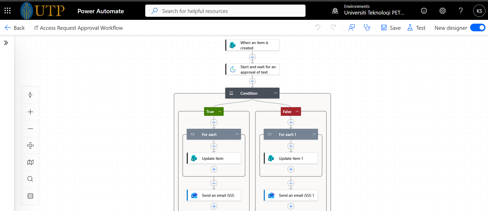
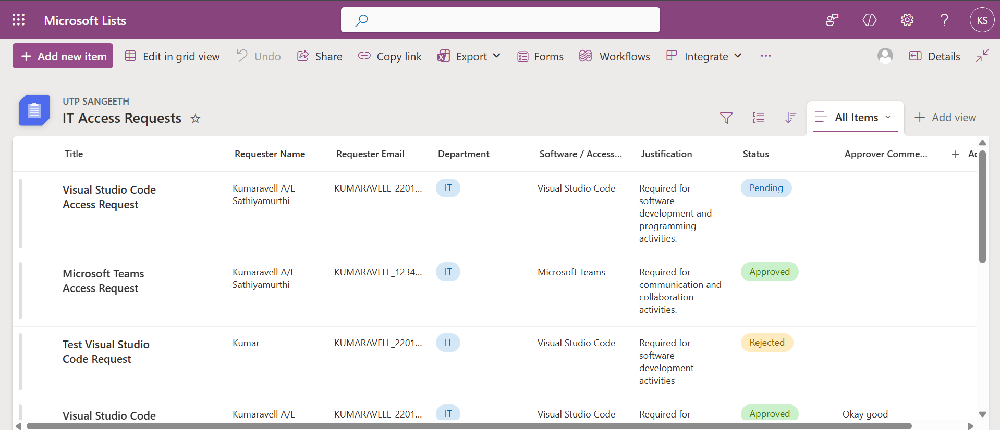
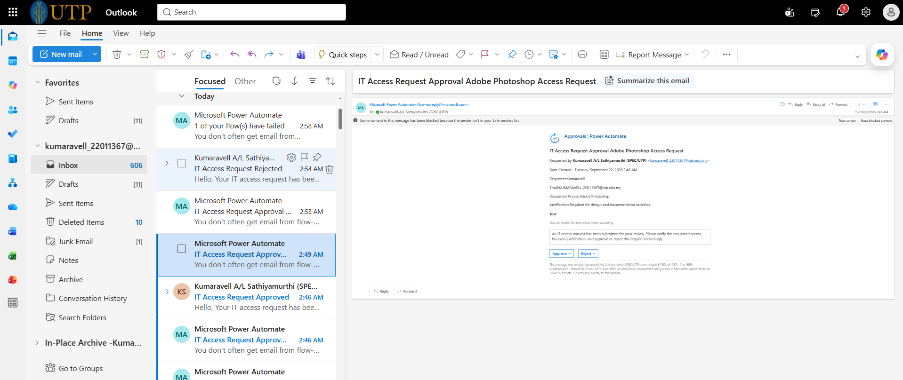
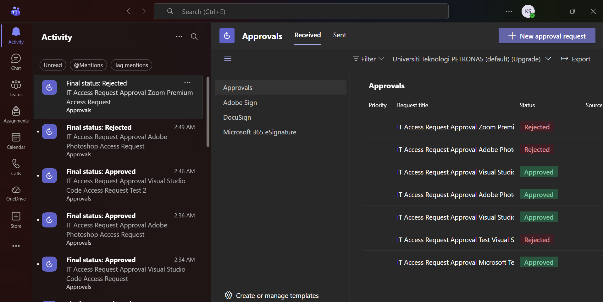

# IT Access Request Automation

## Problem Statement

Traditional IT access request processes often rely on manual submission and email-based approval, which can lead to slower processing times, difficulty tracking requests, and inconsistent record management.

This project aims to improve the process by introducing workflow automation and centralised request management.

---

## Overview

An automated IT access request management solution designed to digitise manual request submission and approval processes.

The system enables users to submit access requests through Microsoft Forms, automatically routes requests for approval using Power Automate, and maintains request records through SharePoint.

---

## Technology Stack

- Microsoft Power Platform
- Microsoft Power Automate
- Microsoft SharePoint
- Microsoft Lists
- Microsoft Forms
- Microsoft Outlook Connector

---

## Workflow

1. User submits an IT access request through Microsoft Forms
2. Request details are stored in SharePoint List
3. Power Automate detects new request submission
4. Approval request is automatically sent to the assigned approver
5. Approver reviews the request:
   - Approval → Request status is updated and notification is sent
   - Rejection → Request status is updated and rejection notification is sent
6. Request records are maintained through SharePoint

---

## Features

✅ Automated approval workflow  
✅ Request status monitoring  
✅ Automatic email notifications  
✅ Reduces manual IT request processing time  
✅ Centralised request management using SharePoint  

---

## Project Structure

```text
IT-Access-Request-Automation
│
├── README.md
│
└── Screenshots
    ├── workflow-overview.png
    ├── sharepoint-list.png
    ├── approval-email-request.png
    └── approval-history.png
```

---

## Testing

The workflow was tested successfully using different approval scenarios.

### Approval Scenario

- User submits an IT access request
- Approver approves the request
- Request status is updated automatically
- Confirmation notification is sent

### Rejection Scenario

- User submits an IT access request
- Approver rejects the request
- Request status is updated automatically
- Rejection notification is sent

---

## Future Improvements

Potential enhancements:

- Develop a Power Apps interface for improved user experience
- Add analytics dashboard for request tracking
- Implement role-based access control
- Integrate with enterprise identity management systems

---

## Screenshots

### Workflow Overview



### SharePoint Request List



### Approval Email Notification



### Approval History



---

## Author

**Kumaravell A/L Sathiyamurthi**

Information Technology Undergraduate
